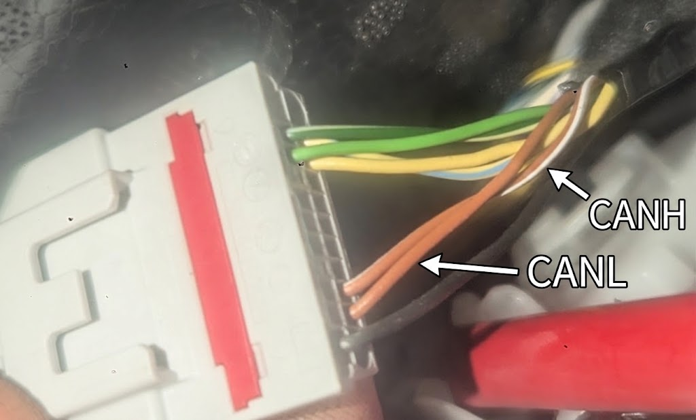

# teslafog

Makes the rear fog lamp on a US-import Tesla Model Y (2023) follow UN Regulation
No. 48, paragraph 6.11.7.3.

## The problems

The car breaks two rules.

**It forgets to stay off (6.11.7.3.1).** Switch the rear fog lamp on, then turn
the lights off. Both go out, which is correct. Turn the lights back on and the
rear fog lamp **comes back on by itself**. It should stay off until the driver
deliberately switches it on again.

The cause: the touchscreen keeps sending "rear fog switch = on" forever. The car
only stops the lamp because the position lamps are off. As soon as they come
back, the lamp returns.

**It lets you switch it on with sidelights only (6.11.7.1).** The rear fog lamp
may only be switched on when the dipped beams, main beams or front fog lamps are
on. Position lamps alone are not enough. With the lights fully off the car
refuses correctly, but with just the parking lights it allows it.

## What this does

A small controller sits on the vehicle CAN bus and watches three messages.

When the position lamps go off, it starts suppressing. From then on, every time
the touchscreen says "fog on", the controller immediately sends the same message
back with only the fog bit cleared. The lamp stays off.

It stops suppressing when the driver presses the fog button off and then on
again **while the beams or front fogs are on**. That is the deliberate action
the regulation asks for, and it only counts when switching on is allowed.

Dropping from dipped beam to sidelights does not switch the lamp off. That is
deliberate: the regulation lets a lamp that was legally lit keep running until
the position lamps go off.

The dash tell-tale follows the real lamp, so it goes out too. Lamp off and
indicator off together, which is what the regulation wants.

The controller never switches the lamp **on**. It can only ever turn it off.

## Hardware

- Arduino Uno R3
- MCP2515 CAN module (HW-184, 8 MHz crystal)
- Optional status LED plus a ~330 ohm resistor
- Powered from the glovebox USB port

Both boards run at 5 V, so they connect directly with no level shifting.

| MCP2515 | Uno |
| ------- | --- |
| VCC | 5V |
| GND | GND |
| CS | D10 |
| SI | D11 |
| SO | D12 |
| SCK | D13 |
| INT | D2 (not used) |
| LED + resistor | D7 |

D13 is the SPI clock, so the Uno's built-in LED flickers with bus traffic. That
is normal. Use D7 for status.

## Where to tap the bus

The connector is on the passenger side A-pillar, unmated. It carries **three**
twisted pairs and only the third one is the right bus. The other two are a
gateway status feed and a second segment; neither carries the messages this
project needs. See [docs/signals.md](docs/signals.md).



**CANH is brown with a white stripe. CANL is solid brown.**

**Check before connecting**, because harness colours are not something to bet a
transceiver on:

1. Car asleep, at least 10 minutes. Measure resistance **between the two wires**
   (not to ground). It should read about **60 ohms** - that is the car's two
   120 ohm terminators in parallel, and nothing else in a car reads that.
2. Car awake. Measure each wire **to bare metal**. Both should sit near
   **2.5 V**. If either reads 12-16 V, stop: that is power, not CAN.

Getting CANH and CANL the wrong way round does no damage, it just does not work.

**Do not fit a termination resistor.** The car already has two. A third breaks
the bus.

Keep the wires to the module short. This is a stub off a transmission line;
a few tens of centimetres is fine, a metre starts causing reflections.

## Build and flash

```
uv run pio run -t upload        # build and flash the controller
uv run pio device monitor       # watch it
uv run pio test -e native       # run the logic tests on your laptop
```

`DRY_RUN` at the top of `src/teslafog_uno.cpp` makes it decide and log without
sending anything. Useful after any change.

## Status LED

| Pattern | Meaning |
| ------- | ------- |
| Fast blink | self-check failed, doing nothing |
| Short flash every 4 s | waiting for the bus |
| Slow blink | backed off after transmit errors |
| Short flash every 2 s | running, not suppressing |
| Solid on | running, suppressing the lamp |

## Reading the heartbeat

One line every 10 seconds:

```
[active] suppress=1 pos=1 lamp=0 sw=1 decided=133 tx=107/arb26/fail0/pend0 backoffs=0 TEC=0 REC=0 EFLG=0x00
```

| Field | Meaning |
| ----- | ------- |
| `[active]` | state: `active`, `listen`, `backoff` or `FAULT` |
| `suppress` | 1 = holding the lamp off |
| `permit` | dipped beam, main beam or front fog is on |
| `pos` | position lamps on |
| `lamp` | rear fog lamp actually lit |
| `sw` | touchscreen fog switch asserted |
| `decided` | frames the logic asked to send |
| `tx` | frames sent |
| `arb` | had to wait for the bus - normal, not an error |
| `fail` | frames that failed - should stay 0 |
| `pend` | still being sent when we looked - normal |
| `backoffs` | times it went passive after errors - should stay 0 |
| `TEC`/`REC` | CAN error counters - should stay 0 |

Healthy: `decided` equals `tx + pend`, and `fail`, `backoffs`, `TEC` and `REC`
are all 0.

## Safety behaviour

- Checks the CAN chip at startup. If anything is wrong it stays silent forever.
- Goes passive if the bus goes quiet, so it does nothing while the car sleeps.
- Goes passive for 5 s if CAN errors build up.
- Watchdog resets it if the code ever hangs.
- If it dies completely, the car simply behaves as it did before. No lamp is
  left on that should be off.

## Known limitations

**About one second at wake.** The lamp is lit while the Uno boots and waits for
the first touchscreen message. Most of that is the bootloader. In practice this
does not come up: a Tesla is awake whenever anyone is working on it, so the
controller is already running. Programming the board over ISP, without a
bootloader, would remove it if it ever mattered.

**Pressing fog on with sidelights only does nothing.** That is correct per
6.11.7.1, but it looks like a fault to the driver. Turn on the dipped beams,
then press the fog button off and on again.

**The touchscreen button still looks switched on** while the lamp is suppressed.
Cosmetic only, and not fixable from the bus: the button shows the touchscreen's
own internal state, and the touchscreen does not listen to the messages it
sends. The amber tell-tale on the dash is the one the regulation cares about
(6.11.8 requires a circuit-closed tell-tale) and that does go out correctly. The
button looking on is also a fair hint that the control is still latched, and
that pressing it off and on again is what re-enables the lamp.

## Layout

```
src/teslafog_uno.cpp    the controller
lib/fogcontrol/         the compliance logic, no hardware, fully tested
lib/tesla/              CAN message decode and encode
test/                   host tests, run with pio test -e native
docs/signals.md         what is on each bus and how it was found
```

## The other sketches

Investigation tools, kept because they are useful if the car changes after a
firmware update. All listen-only unless noted.

| Environment | Purpose |
| ----------- | ------- |
| `uno` | is the MCP2515 hardware still good? Loopback self-test |
| `uno_scan` | which bus is this? Sweeps bit rates, lists every ID |
| `uno_sniff` | which bits changed when I pressed that? One ID range at a time |
| `uno_capture` | do the three messages still decode correctly? |
| `uno_inject` | does injection still work? **Transmits**, single frame or 10 s hold |

That is also the order to work through them if something stops working.

Example:

```
uv run pio run -e uno_scan -t upload
uv run pio device monitor -e uno_scan
```
